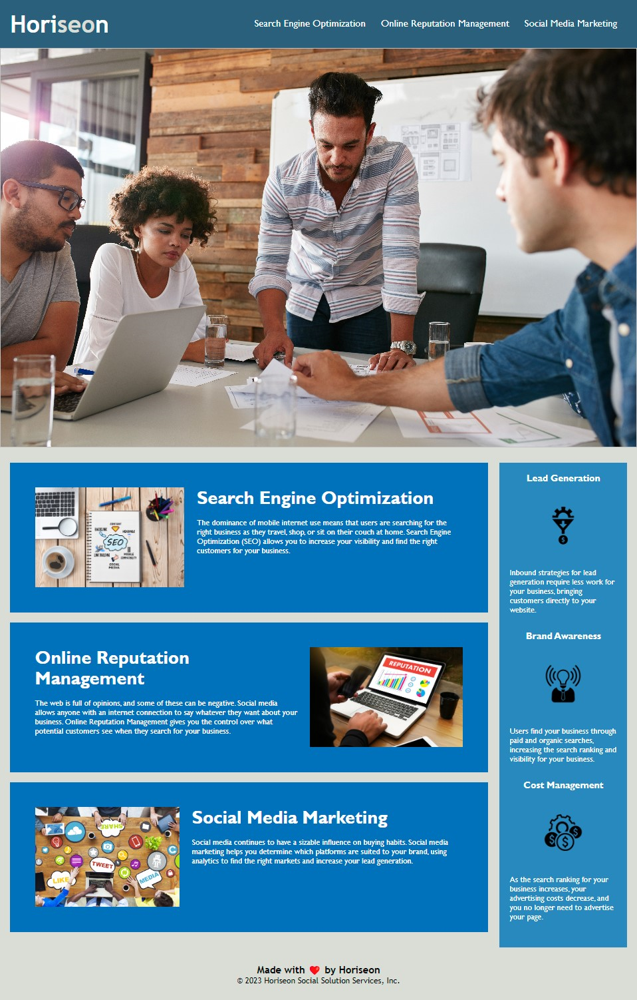

# HW01-Horiseon-Meeting-Accessibility-Standards
## Description
I was hired by a marketing agency to refactor existing code to meet accessiblity standards, which allows the site to be optimized for search engines. Horiseon wants to make sure their site meets these accessiblity standards to ensure that people with disabilities can access their site, which will help them avoid litigation as well. 

## Project Action Steps
- I updated the site to meet accessibility standards. 
- I added semantic HTML elements to the site.
- I confirmed the elements follow a logical structure.
- I added accessible alt attributes to the icon and image elements.
- I confirmed the heading attributes fall in sequential order.
- I added a concise, descriptive title. 
- I edited and confirmed all application links function correctly.
- I consolidated and organized the application's CSS selectors and properties to follow semantic structure.
- I included comments on the application's CSS file for the changes I made.

## Site Screenshot

## Link to Deployed Application

## About the Author
- Email: gpmeyer24@gmail.com
- GitHub: gmeyer24
